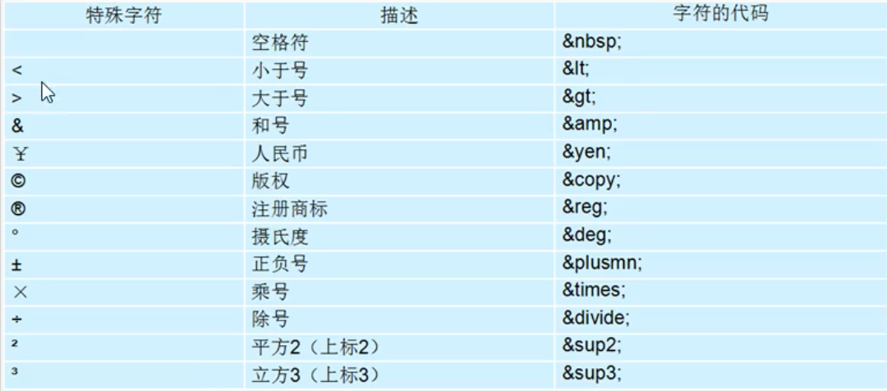

## HTML笔记04常用标签

1、标题标签

```html
<h1>一级标题</h1>
<h2>二级标题</h2>
<h3>三级标题</h3>
<h4>四级标题</h4>
<h5>五级标题</h5>
<h6>六级标题</h6>
```

​	h：head

​	一行显示，加粗，各级大小次降

2、**<u>段落标签</u>** `<p>段落</p>`

​	p：paragraph

3、**<u>换行标签</u>** `<br \>`

​	单标签，br空格反斜杠<br />	br换行不会形成较大的行距，而p标签段落与段落之间有较大空隙。

4、**加粗** `<strong>加粗</strong>` `<b>加粗</b>`

5、**倾斜** `<em>倾斜</em>`    `<i>倾斜</i>`

6、删除线 `<del>删除</del>` `<s>删除</s>`

7、下划线`<ins>下划线</ins>`

8、分区

`<div></div>`        占一行

`<span></span>`    一行可多放

9、**图像标签**

``单标签，src是**必须属性**

``

alt 图像显示不出来时显示的替换文本<br />title 鼠标经过提示文本

``

width 宽度 height高度 px像素 border边框 属性以空格分开

根目录：打开目录文件夹第一层<br />上一级    `../`


10、超链接标签

`<a href="链接" target="跳转方式">文本或图像</a>`

a：anchor

href是必须属性，若为文件或压缩包会下载。`#` 表示空链接<br />target属性默认是_self，覆盖原网页，__blank打开新网页<br />锚点链接：1、href值为`#名字` 2、目标链接为加属性`id = "名字"`

11、注释标签

`<!--注释的内容-->` 快捷键为ctrl + /<br />不执行不显示到页面，用于解释代码，便于阅读理解


特殊字符：



